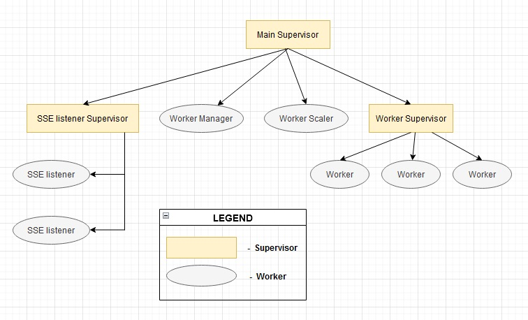
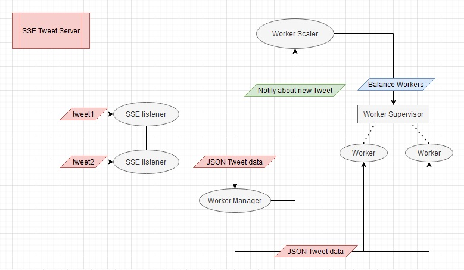
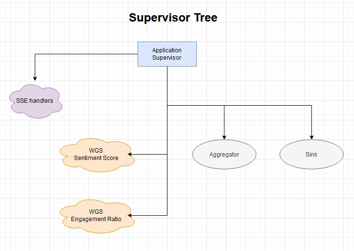
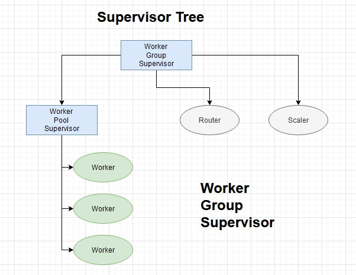
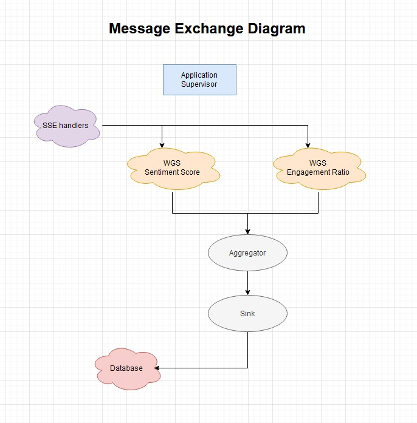
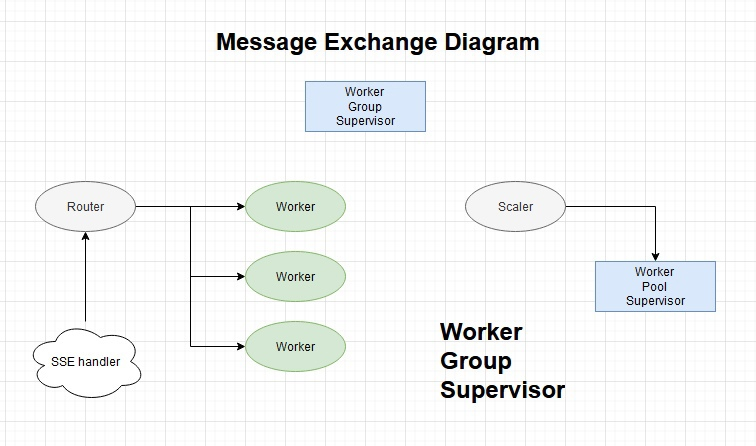

# RTP Documentation.

## Technologies:
1. <b>Erlang language</b> - I chose this language from the list of available ones  [Erlang, Elixir, Scala]:
     1. <b>Erlang vs Scala</b>: wanted to learn a new programming paradigm - functional and as Internet says, it is better suited for working with many parallel tasks.
     2. <b>Erlang vs Elixir</b>: since both languages work on the same virtual machine, I chose Erlang only because its syntax looked much "cleaner".
2. <b>Erlang/OTP</b> - framework for creating distributed systems well suited to solving the problems from this lab. work and just interesting to study.
3. <b>Rebar3</b> - an Erlang tool that makes it easy to compile and run project with a big amount of files. 
4. <b>jsx</b> - an erlang library for manipulating json.
   #### Laboratory 2 update:
5. <b>mongodb-erlang</b> - MongoDB driver for Erlang. 

## Actors:
1. <b>‘Application’</b> - actor to start and stop ‘Main Supervisor’.
2. <b>‘Main Supervisor’</b> - actor to start ‘SSE listener Supervisor’, ‘Worker Supervisor’, ‘Worker Manager’ and ‘Worker Scaler’.
3. <b>‘SSE listener Supervisor’</b> - actor by initialization get a list of URLs and for every URL start a new ‘SSE listener’ actor.
4. <b>‘SSE listener’</b> - actor to establish a SEE connection, listen to all events and send json data to ‘Worker Manager’.
5. <b>‘Worker Manager’</b> - actor to receive json data from listener, notify ‘Worker Scaler’ about new message, choose ‘Worker’ by ‘round-robin distribution’ and send json data to this ‘Worker’.
6. <b>‘Worker Scaler’</b> - actor to start new ‘Workers’ by ‘Worker Supervisor’ or stop useless. Actor will count messages in a time interval and decide how many ‘Workers’ are enough.
7. <b>‘Worker Supervisor’</b> - actor to dynamically balance the amount of ‘Workers’.
8. <b>‘Worker’</b> - actor to receive json data from ‘Worker Manager’, serialize it, sleep for a half of a second to imitate some processing and print data in output.
   #### Laboratory 2 update:
9. <b>‘Worker Group Supervisor’</b> - actor to contain full working group for easier scaling.
10. <b>‘Aggregator’</b> - actor to collect all processing data from all worker groups and transfer full data structure to ‘Sink’.
11. <b>‘Sink’</b> - actor to insert data in database by ‘Batch Size’ or by ‘Timer’.

## Endpoints:
1. <b>‘Worker Manager’</b>: 
   1. Async: {tweet - atom, Tweet - json data string} 
      Get json data to send it to one of ‘Workers’.
2. <b>‘Worker Scaler’</b>: 
   1. Async: {inc - atom} 
      Get signal to increment current counter.
3. <b>‘Worker’</b>: 
   1. Async: {tweet - atom, Tweet - json data string} 
      Process tweet.
4. <b>‘Worker Supervisor’</b>: 
   1. Function call: <b>start_worker/1</b>, when Count - integer 
      Start ‘Count’ amount of workers. 
   2. Function call: <b>stop_worker/1</b>, when Count - integer 
      Stop ‘Count’ amount of workers.
   #### Laboratory 2 update:
5. <b>‘Aggregator’</b>: 
   1. Async: {tweet - atom, ID - integer identity number, Tweet - map data} 
   2. Async: {engage_ratio - atom, ID - integer identity number, EngageRatio - number} 
   3. Async: {sent_score - atom, ID - integer identity number, SentScore - number} 
      Get data and by ID collecting in one data structure.
6. <b>‘Sink’</b>: 
   1. Async: {put - atom, User - map data about user, Tweet - map data about tweet} 
      Get data to insert in database by conditions.
   

## Supervision Tree 

## Message Exchange Diagram

#### Laboratory 2 update:
## Supervision Tree 

## Message Exchange Diagram

