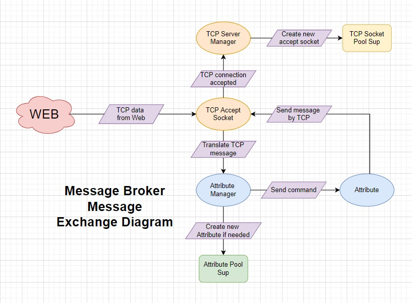

# Message Broker Documentation.

## Technologies:
1. <b>Erlang language</b> - I chose this language from the list of available ones  [Erlang, Elixir, Scala]:
    1. <b>Erlang vs Scala</b>: wanted to learn a new programming paradigm - functional and as Internet says, it is better suited for working with many parallel tasks.
    2. <b>Erlang vs Elixir</b>: since both languages work on the same virtual machine, I chose Erlang only because its syntax looked much "cleaner".
2. <b>Erlang/OTP</b> - framework for creating distributed systems well suited to solving the problems from this lab. work and just interesting to study.
3. <b>Rebar3</b> - an Erlang tool that makes it easy to compile and run project with a big amount of files.
4. <b>jsx</b> - an erlang library for manipulating json.

## Actors:
1. <b>‘Application’</b> - actor to start and stop ‘Main Supervisor’.
2. <b>‘Main Supervisor’</b> - actor to start ‘TCP Server Supervisor’, ‘Message Broker Supervisor’.
3. <b>‘TCP Server Supervisor’</b> - actor by initialization get ‘Listener Socket‘ and sent it to ‘TCP Pool Sup‘ and run ‘TCP Manager‘.
4. <b>‘TCP Pool Supervisor‘</b> - actor to dynamically change amount of ‘TCP Accept Socket’. 
5. <b>‘TCP Accept Socket‘</b> - actor to containing ‘Accept Socket‘ and get and send messages.
6. <b>‘TCP Manager‘</b> - actor to add new ‘TCP Accept Socket‘ by managing ‘TCP Server Supervisor’.
7. <b>‘Message Broker Supervisor’</b> - actor to contain ‘Attribute Manager‘ and ‘Attribute Pool Supervisor‘.
8. <b>‘Attribute Pool Supervisor‘</b> - actor to to dynamically change amount of ‘Attribute’ for every new attribute from ‘Attribute Manager‘.
9. <b>‘Attribute’</b> - actor to contain all subscribed ‘TCP Accept Socket‘ PIDs and send published message to them.
10. <b>‘Attribute Manager‘</b> - actor to send commands for required ‘Attribute‘.

## Endpoints:
1. <b>‘TCP Manager‘</b>: 
    1. Async: {accept - atom} 
       Create new free socket by ‘TCP Pool Supervisor‘.
2. <b>‘TCP Socket Pool Supervisor’</b>: 
   1. Function call: <b>start_socket/0</b> 
      Start new ‘TCP Accept Socket’. 
3. <b>‘TCP Accept Socket’</b>: 
    1. Async: {publish - atom} 
       Send message by TCP socket.
4. <b>‘Attribute Manager’</b>: 
    1. Async: {command - String, attribute - String, Message - string} 
       Manage commands from TCP and send it to ‘Attribute’. 
5. <b>‘Attribute’</b>: 
    1. Async: {subscribe - atom, attribute - atom, PID - pid} 
    2. Async: {unsubscribe - atom, attribute - atom, PID - pid} 
       Subscribe/Unsubscribe some ‘TCP Accept Socket’ to required attribute.
    3. Async: {publish - atom, attribute - atom, Message - string} 
       Send Message to all subscribed ‘TCP Accept Socket’. 
6. <b>‘Attribute Pool Supervisor’</b>: 
    1. Function call: <b>start_attribute/1</b>, when <b>Attribute</b> - atom 
       Start new ‘Attribute’ actor. 

## Supervision Tree

## Message Exchange Diagram

